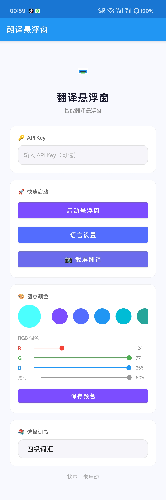
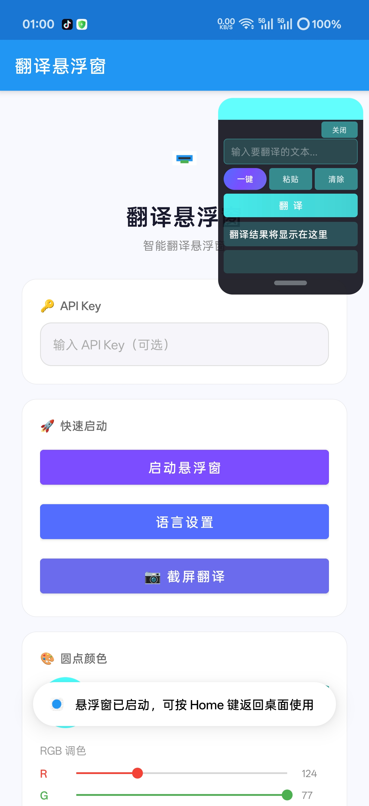
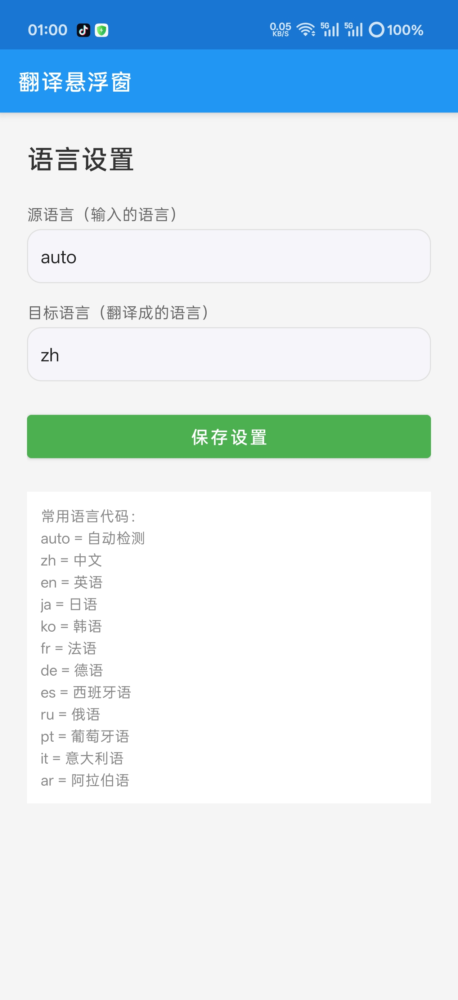
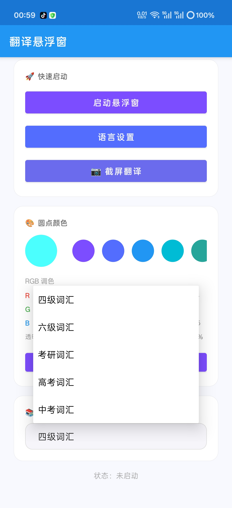
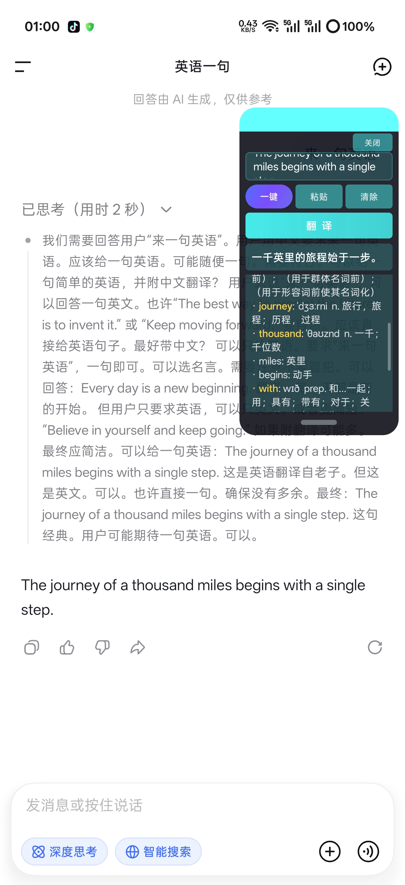

# 翻译悬浮球 · Android 悬浮窗翻译应用

一个**免root**的 Android 悬浮窗翻译工具：在任何应用上方呼出一个可拖动的小圆点，展开即可输入翻译；还支持**屏幕区域截图 OCR 翠译**、四六级/考研词书高亮、色采自定义等特性。

> 建仅所有核心逻辑都在一个模块里，零服务器、零账号，翻译走免费公共 API。

## ✨ 功能特性

- 🎈 **悬浮圆点**：全局悬浮、可拖动、位置记忆；单击展开 / 上滑收起
- 🌐 **文本翻译**：输入即译，走 MyMemory 公共翻译 API
- 📖 **词汇解释**：内置 7000+ 离线词典，Free Dictionary API 兜底
- 📚 **词书高亮**：四级 / 六级 / 考研 / 高考 / 中考词汇黄色加粗标注（词汇表内置）
- 📷 **截屏翻译**：方形悬浮窗 → 框选区域 → 自动截图 → ML Kit OCR → 翛译
- 🎨 **自定义配色**：圆点 RGB 调色 + 20 种预设色，全局 UI 跟随变色
- 🏠 **home 键交互**：单击底部栏弹簧动画收起 / 展开内容区
- 📜 **智能滚动条**：结果区超过 10 行自动出现

## 📱 界面预览

| | | |
|:---:|:---:|:---:|
|  |  |  |
|  |  | |

## 🛠️ 技术栈

| 项 | 说明 |
|---|---|
| 语言 / UI | Kotlin，单模块，ViewBinding |
| 最低支持 | Android 8.0（API 26），targetSdk 34 |
| 翻译 API | MyMemory（免费）、Free Dictionary API（词义兜底） |
| OCR | Google ML Kit 文字识别（中英文，设备端推理，免网络） |
| 网络 | OkHttp 4 + Kotlin Coroutines |
| 动画 | SpringAnimation（androidx.dynamicanimation） |

## 🚀 构建与安装

### 方式一：Android Studio

直接打开项目根目录，等 Gradle Sync 完成后点 Run 即可。

### 方式二：命令行（Windows）

1. 安装 JDK 17 与 Android SDK（含 Platform 34），或先在 Android Studio 打开一次项目让它自动下载；
2. 双击运行 `scripts\build-apk.ps1`，或在项目根目录执行：

```powershell
.\scripts\build-apk.ps1
```

产物：`app\build\outputs\apk\debug\app-debug.apk`

3. 手机 USB 连接开启「开发者模式 + USB 调试」后安装：

```powershell
adb install -r app\build\outputs\apk\debug\app-debug.apk
```

### 首次使用

1. 打开 App → 授予「悬浮窗」（显示在其他应用上层）与「屏幕捕获」权限；
2. 按需在设置里调整圆点颜色与翻译方向；
3. 回到任意界面，点圆点输入文本即可翻译。

> 翜译 API 为境外公共服务，国内网络环境可能需要代理才能访问。

## 📂 项目结构

```
translate-float-ball/
├── app/src/main/java/com/translate/app/
│   ├── MainActivity.kt              # 主界面（权限引导 / 设置入口）
│   ├── FloatingService.kt           # 圆点悬浮窗服务（核心）
│   ├── SquareFloatService.kt        # 截屏翻译方形悬浮窗
│   ├── ProjectionPermissionActivity.kt # 屏幕捕获授权
│   ├── TranslateHelper.kt           # 翻译 API 封装（MyMemory / Free Dictionary）
│   ├── DictionaryManager.kt         # 离线词典管理（assets/dictionary.json）
│   ├── WordBooks.kt                 # 词书聚合（CET4/CET6/考研/高考/中考）
│   ├── Cet4Words.kt 等 5 个          # 各词书词汇表
│   └── SettingsActivity.kt          # 设置页
├── app/src/main/assets/dictionary.json  # 离线词典（816KB）
├── 部分预览图/                      # 界面截图预览
├── scripts/build-apk.ps1            # 一键编译脚本
└── app/build.gradle                 # 依赖配置
```

## ⚠️ 已知限制 / Roadmap

- 翻译质量依赖 MyMemory 免费接口，句子较长时一般；可自行在 `TranslateHelper.kt` 换成任意商用 API
- OCR 仅支持中英（ML Kit 内置模型），暂不支持离线扩展更多语言
- [ ] 欢迎提 Issue / PR：接入更多翻译源、通知栏快捷磁贴、深色模式……

## 📄 License

[MIT](LICENSE)
